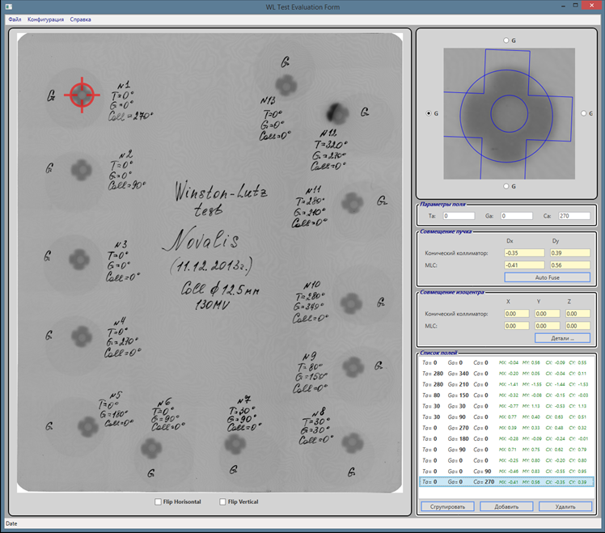

# WL

Winston-Lutz analysis application.

Written in C# and WPF.

Requires Visual Studio 2017.

 
History
=======
This project was developed long time ago to analyze Winston-Lutz Test images at Burdenko Neurosurgery institute.

It is based on image fusion approach.
Application automatically recognize WL ball from BrainLab suite, MLC leaves and conical collimator. Then application calculates ball shift relatively to the MLC and conical collimator.

How to use
==================

Application is not completed. It does not calculate optimal isocenter position. 
It assumes specific test configuration.
Film must be saved in TIFF format with physical pixel size information.

However, anybody can use it as a starter point for their own application for local QA system. Code itself has useful features like as Simplex Optimization from Numerical Recipes and image matching Mutual Information measure.

Image example is located in ***WL\data*** folder.

***Fig.*** Main screen window
